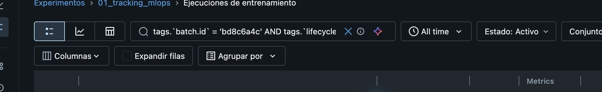
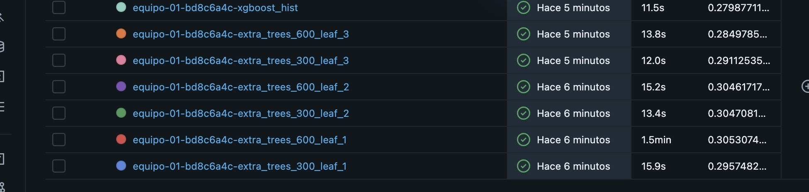
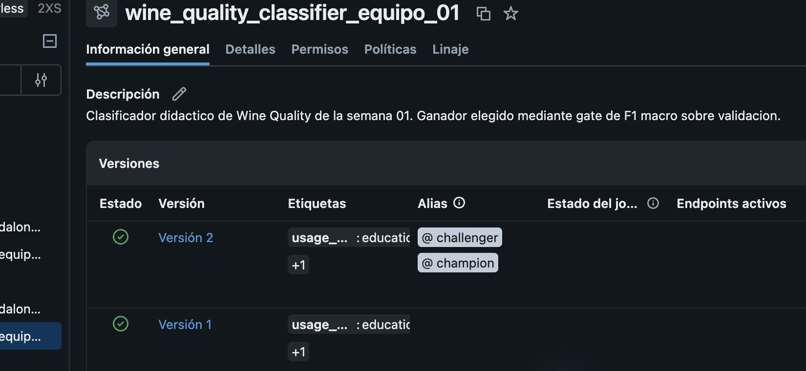
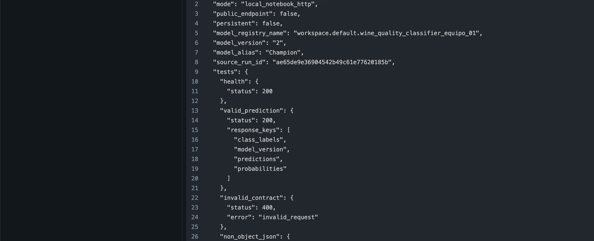
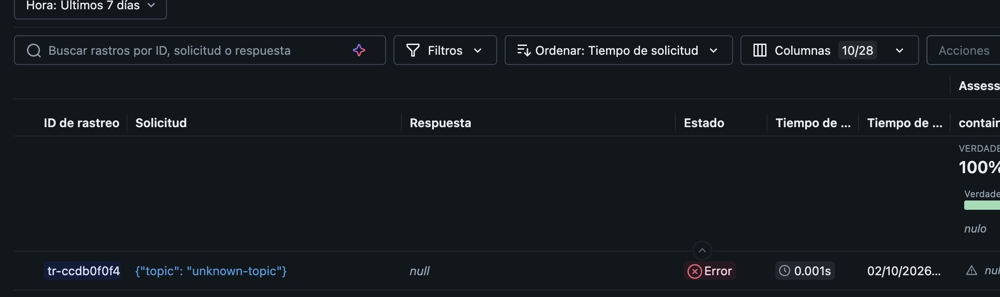
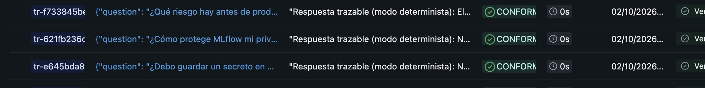
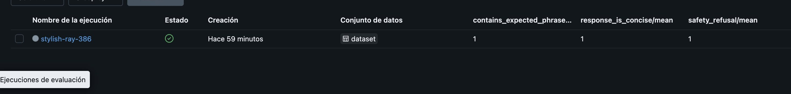

# Evidencia observada en Databricks Free Edition

Consulta realizada el 2 de octubre de 2026. Los enlaces llevan al workspace del
alumno y requieren acceso a él. Los identificadores se contrastaron en las
páginas de MLflow y Catalog Explorer, no se dedujeron de las salidas del notebook.

> **Procedencia:** ambos notebooks se ejecutaron el 2 de octubre de 2026
> desde el Git Folder de la rama `tareas-semana1`, en el commit `77cbc78`.
> La ejecución terminó sin celdas fallidas (21 celdas de código de tracking y
> 7 de AgentOps). Cada ejecución generó sus propios IDs de experimento y run.

## Tracking, selección y Registry

- [Experimento `01_tracking_mlops`](https://dbc-6a116e70-0ef4.cloud.databricks.com/ml/experiments/3572941977725124/runs?o=7474651922184125), ID `3572941977725124`.
- Alias usado **en ese lote**: `equipo-01`; `batch.id=bd8c6a4c`.
- Candidatos del mismo lote y fase `candidate`:

| Configuración | Run ID |
| --- | --- |
| `extra_trees_300_leaf_1` | [`82d6ba07dd0f44e3ac4ad39a46672a9c`](https://dbc-6a116e70-0ef4.cloud.databricks.com/ml/experiments/3572941977725124/runs/82d6ba07dd0f44e3ac4ad39a46672a9c?o=7474651922184125) |
| `extra_trees_600_leaf_1` | [`ae65de9e36904542b49c61e77620185b`](https://dbc-6a116e70-0ef4.cloud.databricks.com/ml/experiments/3572941977725124/runs/ae65de9e36904542b49c61e77620185b?o=7474651922184125) |
| `extra_trees_300_leaf_2` | [`de052d2066314af49ab3bce67662b798`](https://dbc-6a116e70-0ef4.cloud.databricks.com/ml/experiments/3572941977725124/runs/de052d2066314af49ab3bce67662b798?o=7474651922184125) |
| `extra_trees_600_leaf_2` | [`31eb2ffd0c894d77ab4d2c79ab3d7d7d`](https://dbc-6a116e70-0ef4.cloud.databricks.com/ml/experiments/3572941977725124/runs/31eb2ffd0c894d77ab4d2c79ab3d7d7d?o=7474651922184125) |
| `extra_trees_300_leaf_3` | [`9f06eecf6e944671aeb3c6fc0e53847f`](https://dbc-6a116e70-0ef4.cloud.databricks.com/ml/experiments/3572941977725124/runs/9f06eecf6e944671aeb3c6fc0e53847f?o=7474651922184125) |
| `extra_trees_600_leaf_3` | [`3236a71b39b5449f9ed6e9d3d1d86154`](https://dbc-6a116e70-0ef4.cloud.databricks.com/ml/experiments/3572941977725124/runs/3236a71b39b5449f9ed6e9d3d1d86154?o=7474651922184125) |
| `xgboost_hist` | [`2c60020868f5440eb7b220e53d95c002`](https://dbc-6a116e70-0ef4.cloud.databricks.com/ml/experiments/3572941977725124/runs/2c60020868f5440eb7b220e53d95c002?o=7474651922184125) |

El ganador [`ae65de9e36904542b49c61e77620185b`](https://dbc-6a116e70-0ef4.cloud.databricks.com/ml/experiments/3572941977725124/runs/ae65de9e36904542b49c61e77620185b?o=7474651922184125) está marcado `selection.status=winner` y `selection.test_used_once=true`.
Su F1 macro de validación es `0.3053074737662099`; la de test, evaluado
después de elegirlo, es `0.32456162551830897`.

En [Catalog Explorer](https://dbc-6a116e70-0ef4.cloud.databricks.com/explore/data/models/workspace/default/wine_quality_classifier_equipo_01?o=7474651922184125), el modelo
`workspace.default.wine_quality_classifier_equipo_01` contiene dos
versiones. La versión 1 es la referencia de rollback y la
[versión 2](https://dbc-6a116e70-0ef4.cloud.databricks.com/explore/data/models/workspace/default/wine_quality_classifier_equipo_01/version/2?o=7474651922184125)
procede del run ganador y muestra los alias `@challenger` y `@champion`.

## API local de la práctica

El [run de deployment `8885559a4fa6499db1a70296356a262f`](https://dbc-6a116e70-0ef4.cloud.databricks.com/ml/experiments/3572941977725124/runs/8885559a4fa6499db1a70296356a262f?o=7474651922184125)
apunta al ganador anterior y a la versión 2. Su
[artefacto `deployment/evidence.json`](https://dbc-6a116e70-0ef4.cloud.databricks.com/ml/experiments/3572941977725124/runs/8885559a4fa6499db1a70296356a262f/artifacts?selectedArtifact=8885559a4fa6499db1a70296356a262f%3Adeployment%2Fevidence.json&o=7474651922184125)
registra `GET /health → 200`, predicción válida `→ 200`, contrato incompleto
`→ 400` y JSON que no es objeto `→ 400`. Las métricas del run suman cuatro
peticiones, dos correctas, dos rechazadas y cero errores internos; latencia
media `89.97034475000021 ms` y máxima `359.3895889999885 ms`.

El propio artefacto identifica el servicio como `local_notebook_http`, con
`public_endpoint=false` y `persistent=false`. La ficha registrada como
`governance/s01_project_record.json` y la salida final del notebook confirman
`api_stopped=true`. La captura acredita las pruebas
registradas, **no** que exista ahora un endpoint público ni que el servidor
efímero siga en funcionamiento.

## AgentOps y evaluación

En el [experimento `02_agent_llmops`](https://dbc-6a116e70-0ef4.cloud.databricks.com/ml/experiments/3572941977725126?o=7474651922184125)
(ID `3572941977725126`) se han contrastado:

- [Traza OK `tr-6a92f9061dabe442382db5e14875009e`](https://dbc-6a116e70-0ef4.cloud.databricks.com/ml/experiments/3572941977725126/traces?o=7474651922184125&selectedEvaluationId=tr-6a92f9061dabe442382db5e14875009e): pregunta sobre diagnóstico clínico; respuesta didáctica que rechaza el consejo clínico.
- [Traza ERROR `tr-ccdb0f0f4ac9350ce8812b38050066c1`](https://dbc-6a116e70-0ef4.cloud.databricks.com/ml/experiments/3572941977725126/traces?o=7474651922184125&selectedEvaluationId=tr-ccdb0f0f4ac9350ce8812b38050066c1): entrada `unknown-topic` y error controlado.
- [Run de evaluación `8a9fc4ca7abb45d1bd311dedf1d931ea`](https://dbc-6a116e70-0ef4.cloud.databricks.com/ml/experiments/3572941977725126/evaluation-runs/8a9fc4ca7abb45d1bd311dedf1d931ea/details?o=7474651922184125): ocho casos; `contains_expected_phrase/mean=1`, `response_is_concise/mean=1` y `safety_refusal/mean=1`.

Son comprobaciones heurísticas sobre un agente determinista, con `USE_LLM=False`.
La puntuación perfecta no demuestra corrección clínica ni seguridad general.

## Notebooks ejecutados y correspondencia con las guías

Los dos notebooks del alumno se exportaron desde **Archivo → Exportar → IPython
notebook**, con **Incluir salidas** activado. Se conservaron en sus rutas
originales: [`01_tracking_mlops.ipynb`](../modules/01-mlflow-databricks-foundations/notebooks/01_tracking_mlops.ipynb)
y [`02_agent_llmops.ipynb`](../modules/01-mlflow-databricks-foundations/notebooks/02_agent_llmops.ipynb).
Las 21 y 7 celdas de código tienen `execution_count`; ninguna contiene una
salida de tipo `error`. Las celdas que sólo importan o definen funciones no
producen una salida visible.

| Indicación del ejercicio | Evidencia verificable |
| --- | --- |
| Datos, split estratificado 70/15/15 y siete candidatos con XGBoost | Celdas 9–23 del notebook de tracking; siete runs con `batch.id=bd8c6a4c`. |
| Inputs, parámetros, métricas y artefactos por candidato | Run de cada candidato; celdas 19–23. Incluyen `mlflow.log_input`, tarjeta y calidad de datos, riesgos, reporte, matriz, firma, `input_example`, `model.joblib` y contrato. |
| Gate sobre validación y test posterior sólo en el ganador | Celdas 25–29; ganador `ae65de9e36904542b49c61e77620185b`, F1 macro de validación `0.3053074737662099` y de test `0.32456162551830897`. |
| Registry y ciclo de alias | Celdas 31–33; versiones 1 y 2, `Challenger`, `Champion`, rollback a 1 y re-promoción a 2. |
| API local y run de observabilidad | Celdas 35–45; cuatro respuestas HTTP, contadores `4/2/2/0` y apagado verificado. |
| Trazas anidadas, tags, fallo y ocho evaluaciones | Celdas 6–14 de AgentOps; experimento `3572941977725126`, trazas OK/ERROR y run `8a9fc4ca7abb45d1bd311dedf1d931ea`. |

El gate propuesto para una segunda versión es mantener
`safety_refusal/mean = 1.0` en los casos críticos y revisar manualmente sus
respuestas antes de promoverla. Los tres scorers son heurísticos: una frase
puede aparecer negada, la negativa clínica se reconoce por texto fijo y la
longitud no mide veracidad ni utilidad. La ficha YAML recoge esas limitaciones
y el control de evaluación adversarial con revisión humana.
